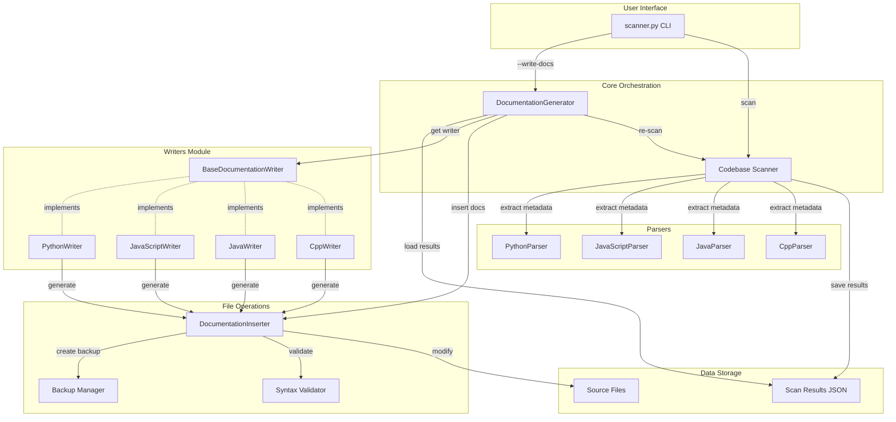
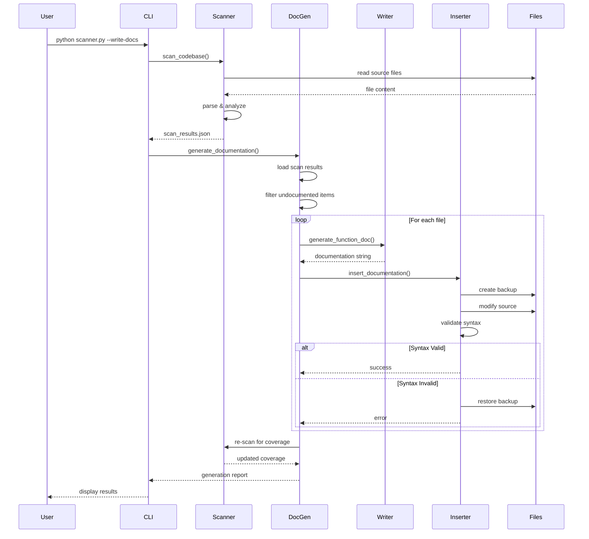
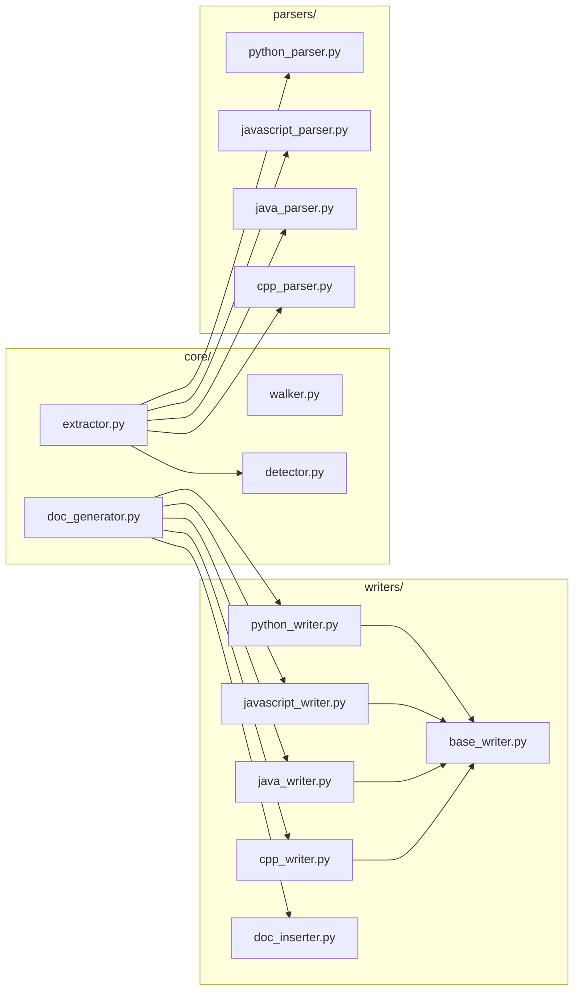
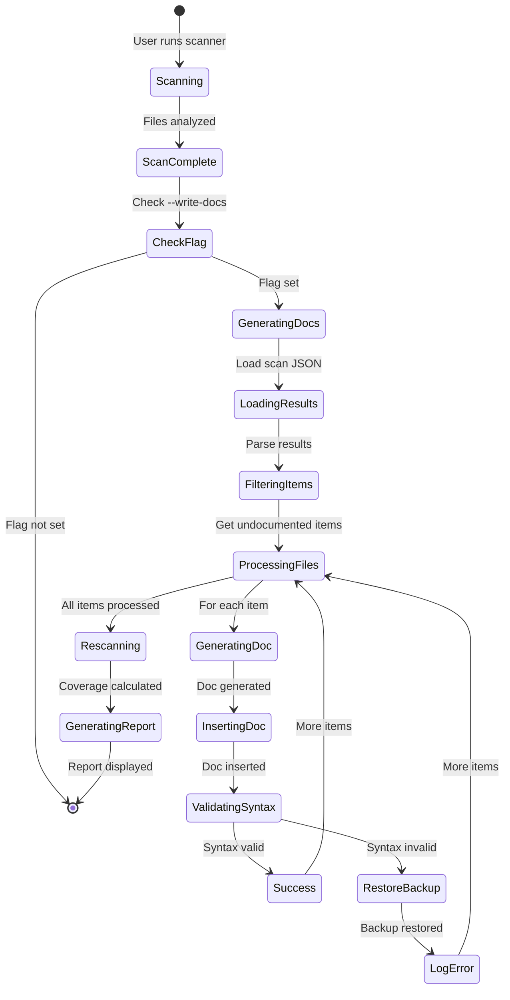
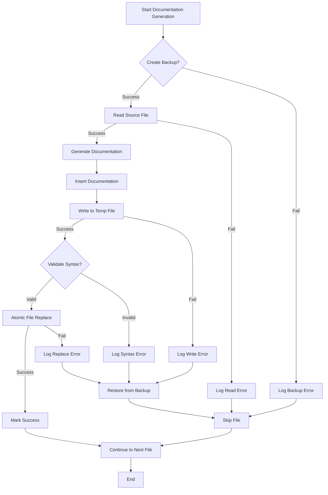
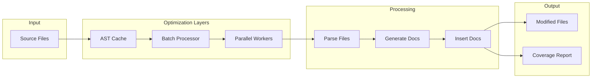
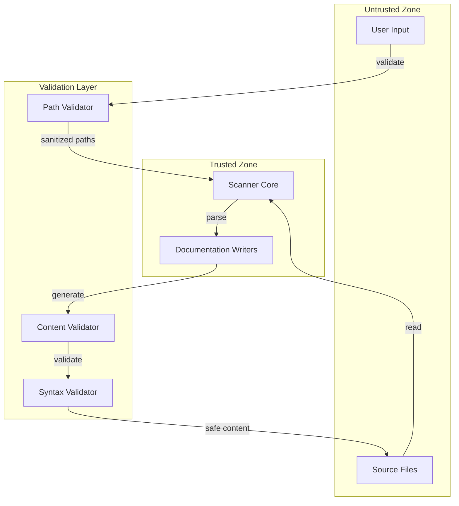
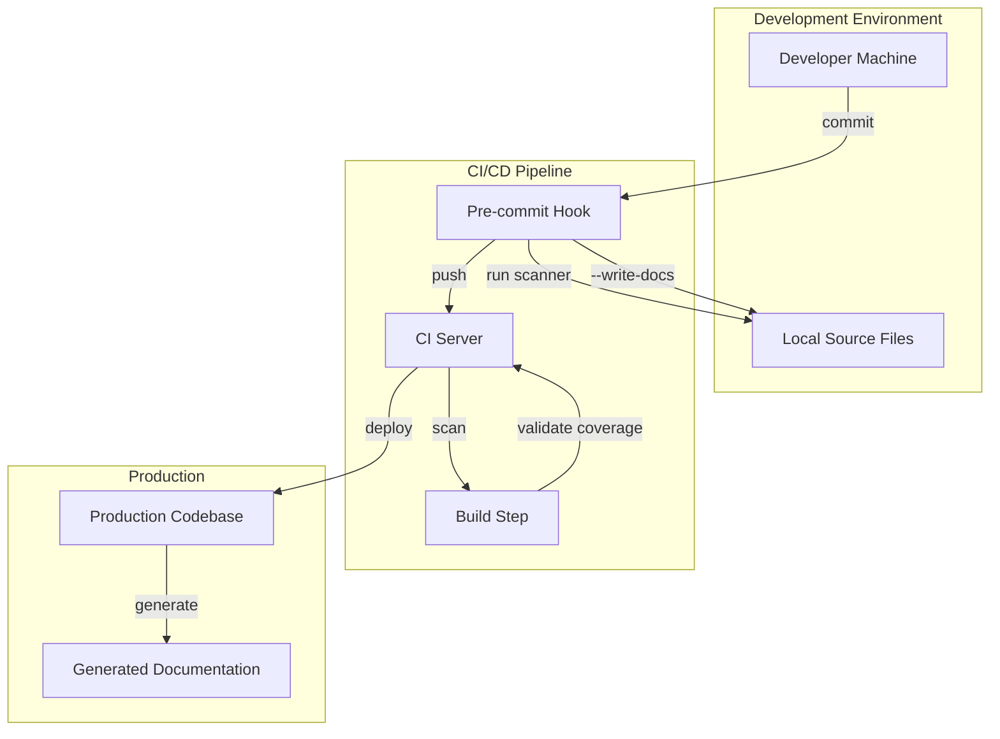

# Architecture Diagram: Documentation Writer System

## System Overview



## Data Flow Diagram



## Component Interaction Matrix

| Component | Depends On | Provides To | Data Exchange |
|-----------|-----------|-------------|---------------|
| CLI | Scanner, DocGen | User | Commands, Results |
| Scanner | Parsers, Formatters | CLI, DocGen | Scan Results JSON |
| DocGen | Writers, Inserter | CLI | Generation Report |
| BaseWriter | - | Language Writers | Abstract Interface |
| PythonWriter | BaseWriter | DocGen | Python Docstrings |
| JavaScriptWriter | BaseWriter | DocGen | JSDoc Comments |
| JavaWriter | BaseWriter | DocGen | Javadoc Comments |
| CppWriter | BaseWriter | DocGen | Doxygen Comments |
| Inserter | Validator, Backup | DocGen | File Modifications |
| Parsers | - | Scanner | Metadata Extraction |

## Module Dependencies



## File Structure

```
codebase-scanner/
├── scanner.py                    # Main CLI entry point (MODIFIED)
├── config.json                   # Configuration (EXTENDED)
│
├── core/
│   ├── __init__.py
│   ├── walker.py                 # Directory traversal
│   ├── detector.py               # Language detection
│   ├── extractor.py              # Metadata extraction
│   └── doc_generator.py          # NEW: Documentation orchestrator
│
├── parsers/
│   ├── __init__.py
│   ├── base_parser.py            # Parser base class
│   ├── python_parser.py          # Python AST parser
│   ├── javascript_parser.py      # JS/TS regex parser
│   ├── java_parser.py            # Java regex parser
│   └── cpp_parser.py             # C/C++ regex parser
│
├── writers/                      # NEW: Documentation writers
│   ├── __init__.py
│   ├── base_writer.py            # Abstract base writer
│   ├── python_writer.py          # Google-style docstrings
│   ├── javascript_writer.py      # JSDoc comments
│   ├── java_writer.py            # Javadoc comments
│   ├── cpp_writer.py             # Doxygen comments
│   └── doc_inserter.py           # Safe file modification
│
├── formatters/
│   ├── __init__.py
│   ├── json_formatter.py         # JSON output
│   └── markdown_formatter.py     # Markdown output
│
├── utils/
│   ├── __init__.py
│   ├── logger.py                 # Logging utilities
│   └── filters.py                # File filtering
│
├── tests/
│   ├── __init__.py
│   ├── conftest.py
│   ├── test_python_parser.py
│   ├── test_detector.py
│   ├── test_filters.py
│   ├── test_python_writer.py     # NEW: Writer tests
│   ├── test_javascript_writer.py # NEW
│   ├── test_java_writer.py       # NEW
│   ├── test_cpp_writer.py        # NEW
│   └── test_doc_inserter.py      # NEW
│
└── output/
    ├── documentation.json        # Scan results
    └── documentation.md          # Markdown report
```

## State Transitions



## Error Handling Flow



## Performance Optimization Strategy



## Security Boundaries



## Deployment Architecture



## Key Design Principles

1. **Separation of Concerns**: Each module has a single, well-defined responsibility
2. **Language Agnostic Core**: Core logic independent of specific languages
3. **Safe File Operations**: Always backup, validate, and use atomic operations
4. **Extensibility**: Easy to add new language support via inheritance
5. **Error Resilience**: Graceful degradation with detailed error reporting
6. **Performance**: Batch processing and caching for large codebases
7. **Security**: Input validation and sandboxed execution
8. **Testability**: Clear interfaces and dependency injection

## Extension Points

To add support for a new language:

1. Create new parser in `parsers/` (inherit from `BaseParser`)
2. Create new writer in `writers/` (inherit from `BaseDocumentationWriter`)
3. Add language mapping in `core/extractor.py`
4. Add syntax validator in `writers/doc_inserter.py`
5. Add configuration in `config.json`
6. Create unit tests in `tests/`

Example for adding Rust support:

```python
# parsers/rust_parser.py
class RustParser(BaseParser):
    def parse(self) -> Dict[str, Any]:
        # Implement Rust-specific parsing
        pass

# writers/rust_writer.py
class RustDocumentationWriter(BaseDocumentationWriter):
    def get_doc_start_marker(self) -> str:
        return '///'
    
    def generate_function_doc(self, func_info: Dict) -> str:
        # Generate Rust doc comments
        pass