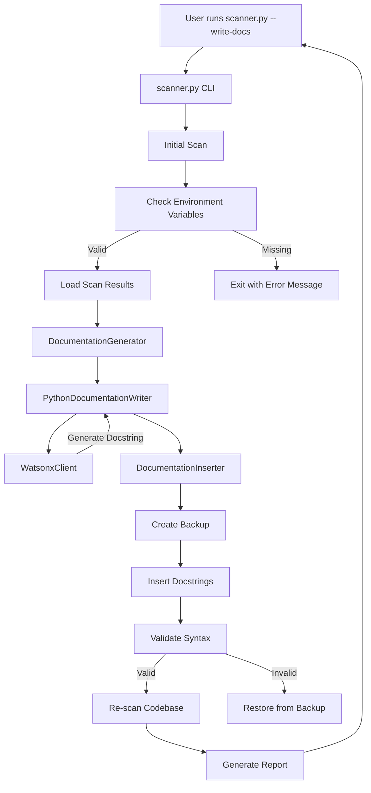
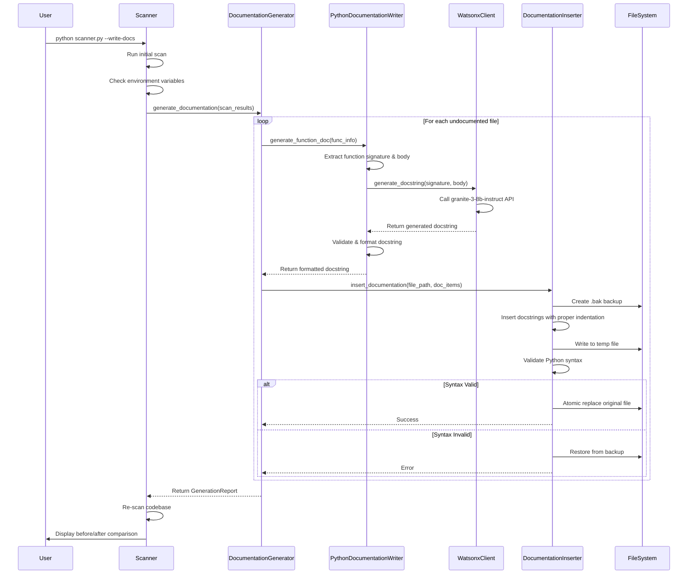
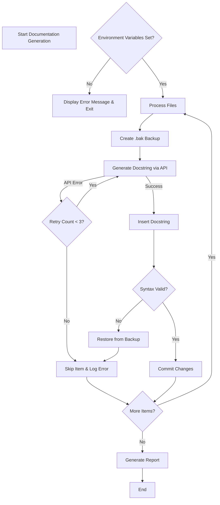
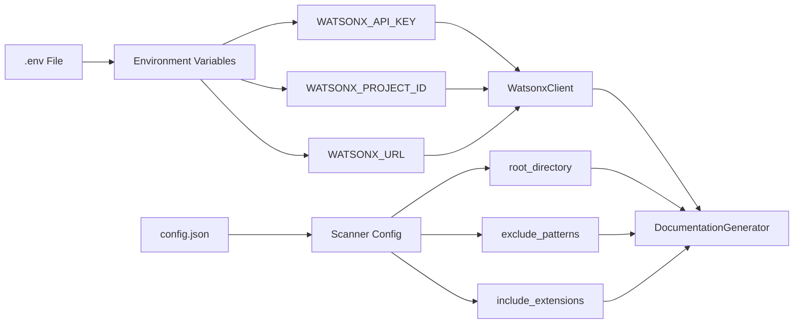
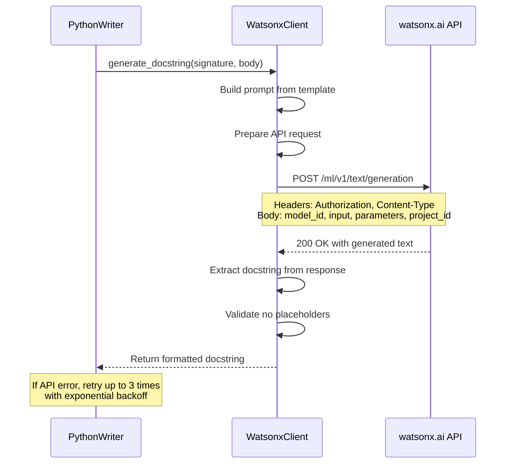
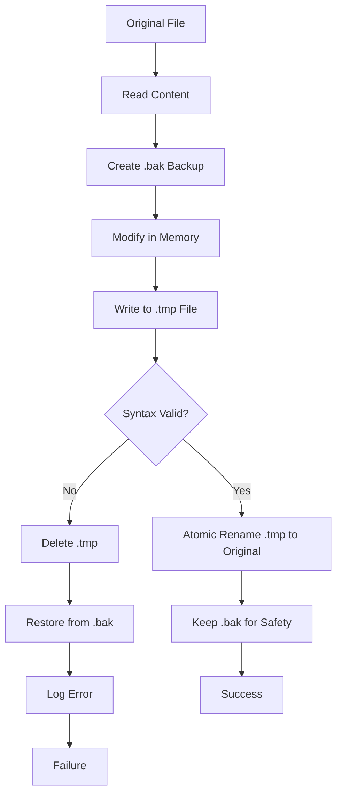
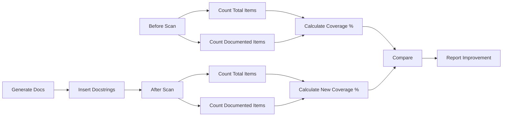
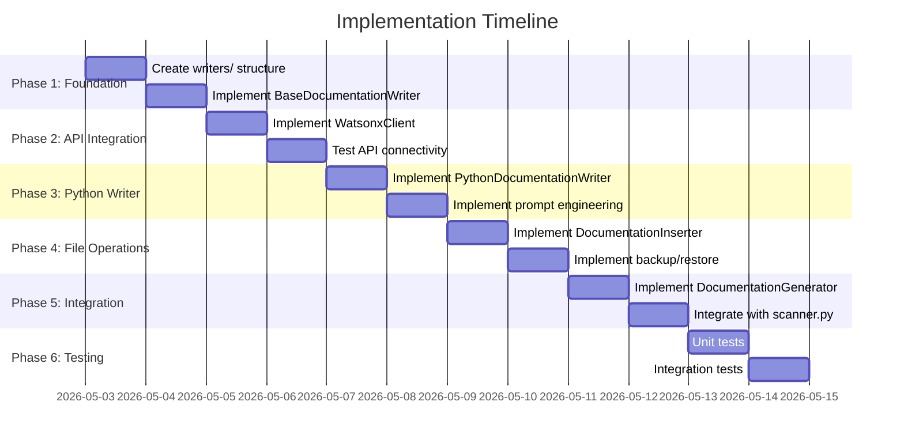

# --write-docs Feature Architecture

## System Overview



## Component Interaction Flow



## Data Flow

```mermaid
graph LR
    A[Scan Results JSON] --> B[Filter Python Files]
    B --> C[Filter Undocumented Items]
    C --> D[Extract Function Context]
    D --> E[Generate Prompt]
    E --> F[watsonx.ai API]
    F --> G[Parse Response]
    G --> H[Format Docstring]
    H --> I[Insert into File]
    I --> J[Validate Syntax]
    J --> K[Updated Source File]
    K --> L[Re-scan]
    L --> M[Coverage Report]
```



## Module Structure

```
codebase-scanner/
│
├── scanner.py                    # Main CLI entry point
│   ├── main()                    # Parse args, orchestrate workflow
│   ├── scan_codebase()          # Existing scan functionality
│   └── [NEW] --write-docs flag  # Trigger documentation generation
│
├── core/
│   ├── walker.py                # Directory traversal (existing)
│   ├── extractor.py             # Metadata extraction (existing)
│   └── doc_generator.py         # [NEW] Documentation orchestrator
│       ├── generate_documentation()
│       ├── _process_file()
│       ├── _filter_python_files()
│       └── _filter_undocumented()
│
├── writers/                      # [NEW] Documentation generation
│   ├── __init__.py
│   ├── base_writer.py           # Abstract base class
│   │   ├── generate_function_doc()
│   │   ├── generate_class_doc()
│   │   ├── generate_method_doc()
│   │   └── validate_documentation()
│   │
│   ├── watsonx_client.py        # watsonx.ai API client
│   │   ├── __init__()           # Load credentials from env
│   │   ├── generate_docstring() # Call granite-3-8b-instruct
│   │   ├── _build_prompt()      # Construct API prompt
│   │   └── _handle_response()   # Parse API response
│   │
│   ├── python_writer.py         # Python-specific writer
│   │   ├── generate_function_doc()
│   │   ├── generate_class_doc()
│   │   ├── generate_method_doc()
│   │   ├── _extract_signature()
│   │   ├── _extract_body()
│   │   └── _format_docstring()
│   │
│   └── doc_inserter.py          # Safe file modification
│       ├── insert_documentation()
│       ├── create_backup()
│       ├── validate_python_syntax()
│       ├── restore_backup()
│       └── _get_indentation()
│
├── parsers/                      # Existing parsers
│   └── python_parser.py         # Extract function/class metadata
│
└── formatters/                   # Existing formatters
    ├── json_formatter.py        # JSON output
    └── markdown_formatter.py    # Markdown output
```

## Key Design Patterns

### 1. Strategy Pattern
- **BaseDocumentationWriter** defines interface
- Language-specific writers implement strategy
- Easy to add new languages (JavaScript, Java, C++)

### 2. Template Method Pattern
- **DocumentationGenerator** orchestrates workflow
- Delegates language-specific logic to writers
- Consistent error handling across all languages

### 3. Facade Pattern
- **WatsonxClient** hides API complexity
- Simple interface: `generate_docstring(signature, body)`
- Handles authentication, retries, error handling

### 4. Command Pattern
- **DocItem** encapsulates insertion operation
- Supports undo via backup/restore
- Enables batch processing

## Error Handling Strategy



## Configuration Flow



## API Request/Response Flow



## File Modification Safety



## Coverage Calculation



## Implementation Phases



## Success Metrics

| Metric | Target | Measurement |
|--------|--------|-------------|
| Documentation Coverage | 80%+ | Before/after scan comparison |
| Syntax Validity | 100% | All modified files must parse |
| No Placeholders | 100% | Validation check on all docstrings |
| API Success Rate | 95%+ | Successful API calls / total calls |
| Processing Speed | <1s per function | Time per docstring generation |
| Backup Success | 100% | All files backed up before modification |

## Risk Mitigation

| Risk | Impact | Mitigation |
|------|--------|------------|
| API Failure | High | Retry logic, graceful degradation |
| Syntax Errors | High | Validation + automatic rollback |
| File Corruption | Critical | Mandatory backups, atomic operations |
| Poor Quality Docs | Medium | Prompt engineering, validation |
| Rate Limiting | Medium | Exponential backoff, batch processing |
| Missing Credentials | High | Clear error messages, .env.example |

## Next Steps

1. ✅ Review architecture and approve design
2. Switch to Code mode for implementation
3. Start with Phase 1: Foundation
4. Proceed sequentially through phases
5. Test thoroughly at each phase
6. Deploy and monitor