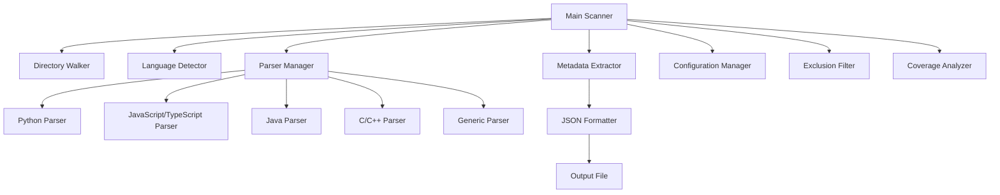

# File Scanner Script - Implementation Plan

## Overview
Create a robust, extensible file scanner that walks through codebases, extracts functions and classes, and prepares structured metadata for documentation generation.

## Architecture Design

### Core Components



### File Structure

```
codebase-scanner/
├── scanner.py                 # Main entry point
├── config.json               # Configuration file
├── core/
│   ├── __init__.py
│   ├── walker.py            # Directory traversal
│   ├── detector.py          # Language detection
│   └── extractor.py         # Metadata extraction
├── parsers/
│   ├── __init__.py
│   ├── base_parser.py       # Abstract base class
│   ├── python_parser.py     # Python-specific parser
│   ├── javascript_parser.py # JS/TS parser
│   ├── java_parser.py       # Java parser
│   ├── cpp_parser.py        # C/C++ parser
│   └── generic_parser.py    # Fallback parser
├── formatters/
│   ├── __init__.py
│   └── json_formatter.py    # JSON output
├── utils/
│   ├── __init__.py
│   ├── logger.py            # Logging system
│   └── filters.py           # Exclusion patterns
├── tests/
│   └── test_parsers.py      # Unit tests
├── output/
│   └── documentation.json   # Generated output
└── README.md                # Usage documentation
```

## JSON Output Schema

```json
{
  "scan_metadata": {
    "timestamp": "2026-05-01T14:51:00Z",
    "root_directory": "/path/to/project",
    "total_files": 150,
    "total_functions": 450,
    "total_classes": 120,
    "languages_detected": ["python", "javascript", "java"]
  },
  "files": [
    {
      "path": "src/utils/helper.py",
      "language": "python",
      "size_bytes": 2048,
      "line_count": 85,
      "classes": [
        {
          "name": "DataProcessor",
          "line_start": 10,
          "line_end": 45,
          "docstring": "Processes data from various sources",
          "methods": [
            {
              "name": "process",
              "line_start": 15,
              "line_end": 30,
              "parameters": [
                {
                  "name": "data",
                  "type": "dict",
                  "default": null
                },
                {
                  "name": "validate",
                  "type": "bool",
                  "default": "True"
                }
              ],
              "return_type": "ProcessedData",
              "docstring": "Process input data with optional validation",
              "decorators": ["@staticmethod"],
              "is_async": false,
              "visibility": "public"
            }
          ],
          "base_classes": ["BaseProcessor"],
          "decorators": []
        }
      ],
      "functions": [
        {
          "name": "calculate_sum",
          "line_start": 50,
          "line_end": 55,
          "parameters": [
            {
              "name": "numbers",
              "type": "List[int]",
              "default": null
            }
          ],
          "return_type": "int",
          "docstring": "Calculate sum of numbers",
          "decorators": [],
          "is_async": false
        }
      ],
      "imports": [
        "from typing import List, Dict",
        "import json"
      ],
      "documentation_coverage": 85.5
    }
  ],
  "coverage_report": {
    "overall_coverage": 72.3,
    "by_language": {
      "python": 85.0,
      "javascript": 65.5,
      "java": 70.2
    },
    "undocumented_items": [
      {
        "file": "src/api/routes.js",
        "type": "function",
        "name": "handleRequest",
        "line": 45
      }
    ]
  }
}
```

## Language-Specific Parsing Strategies

### Python Parser
- Use [`ast`](https://docs.python.org/3/library/ast.html) module for syntax tree analysis
- Extract docstrings from function and class definitions
- Parse type hints from function signatures
- Identify decorators and async functions
- Support both Google and NumPy docstring formats

### JavaScript/TypeScript Parser
- Use regex patterns combined with [`esprima`](https://esprima.org/) or similar AST parser
- Extract JSDoc comments
- Parse function declarations, arrow functions, and class methods
- Handle TypeScript type annotations
- Support ES6+ syntax including async/await

### Java Parser
- Use regex patterns or [`javalang`](https://github.com/c2nes/javalang) library
- Extract Javadoc comments
- Parse method signatures with access modifiers
- Identify class hierarchies and interfaces
- Handle generics and annotations

### C/C++ Parser
- Use regex patterns or [`pycparser`](https://github.com/eliben/pycparser) for C
- Extract Doxygen-style comments
- Parse function declarations and definitions
- Identify class structures in C++
- Handle templates and namespaces

## Configuration Options

```json
{
  "root_directory": ".",
  "output_file": "output/documentation.json",
  "exclude_patterns": [
    "node_modules/**",
    "venv/**",
    "*.min.js",
    "dist/**",
    "build/**",
    ".git/**"
  ],
  "include_extensions": [
    ".py", ".js", ".ts", ".jsx", ".tsx",
    ".java", ".c", ".cpp", ".h", ".hpp"
  ],
  "max_file_size_mb": 10,
  "follow_symlinks": false,
  "extract_imports": true,
  "calculate_coverage": true,
  "verbose_logging": true
}
```

## Key Features

### 1. Extensible Parser System
- Abstract base class for all parsers
- Easy to add new language support
- Fallback to generic parser for unsupported languages

### 2. Smart Language Detection
- File extension mapping
- Shebang line detection for scripts
- Content-based detection as fallback

### 3. Robust Error Handling
- Continue scanning on parse errors
- Log problematic files for review
- Graceful degradation for partial parsing

### 4. Performance Optimization
- Parallel processing for large codebases
- File size limits to avoid memory issues
- Incremental scanning support

### 5. Documentation Coverage Analysis
- Calculate percentage of documented items
- Identify undocumented functions and classes
- Generate coverage reports by file and language

## Implementation Steps

1. **Setup Project Structure** - Create directory layout and base files
2. **Core Walker** - Implement directory traversal with exclusion filters
3. **Language Detection** - Build file extension and content-based detection
4. **Base Parser** - Create abstract parser interface
5. **Python Parser** - Implement AST-based Python parsing
6. **JavaScript Parser** - Implement JS/TS parsing with JSDoc extraction
7. **Java Parser** - Implement Java parsing with Javadoc extraction
8. **C/C++ Parser** - Implement C/C++ parsing with Doxygen extraction
9. **Metadata Extractor** - Build unified metadata extraction layer
10. **JSON Formatter** - Implement structured JSON output
11. **Configuration System** - Add config file support
12. **Coverage Analyzer** - Build documentation coverage calculator
13. **Logging System** - Add comprehensive logging
14. **Testing** - Create unit tests for each component
15. **Documentation** - Write README with examples

## Usage Examples

### Basic Usage
```bash
python scanner.py --root /path/to/project --output docs.json
```

### With Configuration
```bash
python scanner.py --config config.json
```

### Specific Languages Only
```bash
python scanner.py --root . --languages python,javascript --output output.json
```

### Generate Coverage Report
```bash
python scanner.py --root . --coverage-report --output docs.json
```

## Dependencies

```
# Core dependencies
- Python 3.8+

# Parsing libraries
- ast (built-in)
- esprima (for JavaScript)
- javalang (for Java)
- pycparser (for C/C++)

# Utilities
- pathlib (built-in)
- json (built-in)
- logging (built-in)
- argparse (built-in)
- typing (built-in)
```

## Success Criteria

- ✅ Scans entire codebase recursively
- ✅ Supports Python, JavaScript, TypeScript, Java, C/C++
- ✅ Extracts functions, classes, methods with full metadata
- ✅ Generates structured JSON output
- ✅ Calculates documentation coverage
- ✅ Handles errors gracefully
- ✅ Configurable via config file
- ✅ Extensible for new languages
- ✅ Well-documented with examples
- ✅ Includes unit tests

## Next Steps

After reviewing this plan, we can switch to Code mode to implement the file scanner script with all the components outlined above.